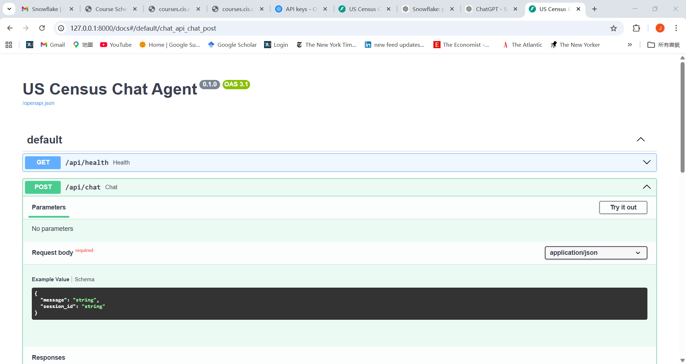

### US Census Chat Agent

An interactive chat-based web application that answers natural language questions about US population data using the Snowflake US Open Census dataset.

---

### Features

- Natural language → SQL query generation
- Live querying from Snowflake Marketplace dataset
- Chat-style web interface with frontend and backend
- Metric-based query understanding for topics such as population and income
- Transparent responses including:
  - Generated SQL
  - Query results
  - Debug notes

---

### Expected Output

Below is an example of the chat interface and response output:



The application displays:
- User question in natural language  
- Generated SQL query  
- Retrieved results from Snowflake  
- Optional debug notes for transparency  

---

### File Descriptions

#### API Layer
- `main.py` - Initializes and runs the FastAPI application  
- `routes.py` - Defines API endpoints for chat requests  
- `schemas.py` - Defines request and response data models  
- `deps.py` - Provides shared dependencies across the API  

#### Core Utilities
- `config.py` - Loads environment variables and configuration  
- `guardrails.py` - Validates and filters user input/output  
- `logging.py` - Sets up application logging  
- `memory.py` - Manages conversation session memory  

#### LLM Layer
- `intent_parser.py` - Parses user queries into structured intent  
- `answer_generator.py` - Converts query results into responses  
- `prompts.py` - Stores prompt templates for LLM usage  

#### Data Layer
- `snowflake_client.py` - Connects to and queries Snowflake  
- `sql_builder.py` - Builds SQL queries from parsed intent  
- `metric_catalog.py` - Maps metrics to dataset columns  
- `geography_catalog.py` - Maps locations to query filters  

#### Service Layer
- `chat_service.py` - Handles end-to-end chat workflow  

#### Frontend
- `index.html` - Chat interface structure  
- `app.js` - Frontend logic and API calls  
- `style.css` - UI styling  

#### Testing
- `test_guardrails.py` - Tests validation logic  
- `test_sql_builder.py` - Tests SQL generation  
- `test_intent_parser.py` - Tests intent parsing  
- `test_chat_api.py` - Tests API endpoints  

#### Root Files
- `.env.example` - Environment variable template  
- `requirements.txt` - Python dependencies  
- `README.md` - Project documentation  
- `instruction.md` - Setup and run instructions  
- `reflection.md` - Project evaluation and insights

---

### File Structure

```text
us-census-chat-agent/
├─ app/
│  ├─ api/
│  │  ├─ main.py
│  │  ├─ routes.py
│  │  ├─ schemas.py
│  │  └─ deps.py
│  ├─ core/
│  │  ├─ config.py
│  │  ├─ guardrails.py
│  │  ├─ logging.py
│  │  └─ memory.py
│  ├─ llm/
│  │  ├─ intent_parser.py
│  │  ├─ answer_generator.py
│  │  └─ prompts.py
│  ├─ data/
│  │  ├─ snowflake_client.py
│  │  ├─ sql_builder.py
│  │  ├─ metric_catalog.py
│  │  └─ geography_catalog.py
│  └─ services/
│     └─ chat_service.py
├─ frontend/
│  ├─ index.html
│  ├─ app.js
│  └─ style.css
├─ tests/
│  ├─ test_guardrails.py
│  ├─ test_sql_builder.py
│  ├─ test_intent_parser.py
│  └─ test_chat_api.py
├─ .env.example
├─ requirements.txt
├─ README.md
├─ instruction.md
└─ reflection.md
